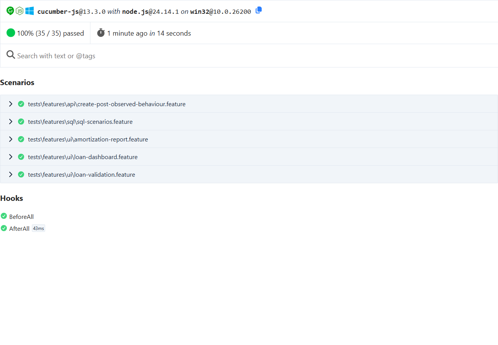

# Loan Analytics Dashboard — Streamhub QA Automation Assessment

Submission for **Section A (Web Application + UI Automation)** of the Streamhub Fullstack + QA
Automation Assessment. It contains a React loan analytics app, a Playwright + Cucumber framework
that tests it (UI, API and SQL), the A3 API tests against JSONPlaceholder, both A4 SQL
scenarios, and the AI self-healing locator exercise with a working proof of concept.



## Contents

1. [Project overview](#1-project-overview)
2. [Assessment coverage](#2-assessment-coverage)
3. [Tech stack](#3-tech-stack)
4. [Application features](#4-application-features)
5. [Architecture](#5-architecture)
6. [Folder structure](#6-folder-structure)
7. [Prerequisites](#7-prerequisites)
8. [Installation](#8-installation)
9. [Environment configuration](#9-environment-configuration)
10. [Running the application](#10-running-the-application)
11. [Running UI tests](#11-running-ui-tests)
12. [Running API tests](#12-running-api-tests)
13. [Running SQL tests](#13-running-sql-tests)
14. [Generating reports](#14-generating-reports)
15. [Test results](#15-test-results)
16. [AI self-healing locator strategy](#16-ai-self-healing-locator-strategy)
17. [AI-assisted development / Claude Code reflection](#17-ai-assisted-development--claude-code-reflection)
18. [Engineering decisions](#18-engineering-decisions)
19. [Known limitations](#19-known-limitations)
20. [Assessment requirement mapping](#20-assessment-requirement-mapping)

## 1. Project overview

The **Loan Analytics Dashboard** is an EMI calculator in the spirit of emicalculator.net, built
to be automated well:

- **Dashboard:** a loan form, five calculated summary cards, a principal-vs-interest doughnut
  chart and a year-wise stacked bar chart.
- **Amortization report:** driven by the same loan input plus year-range and grouping filters,
  with period totals, an outstanding-balance line chart and the schedule table.

The submitted loan lives in the URL (`/report?amount=2500000&rate=10&tenure=10&unit=years`), so
every view is deep-linkable and the report always reflects the user's input.

## 2. Assessment coverage

| Area                     | Delivered                                                                                                                     |
| ------------------------ | ----------------------------------------------------------------------------------------------------------------------------- |
| Framework rules          | Cucumber features → step definitions → Page Objects → app; `BASE_URL` from env; role/label/test-id locators only              |
| A1 Web application       | Dashboard, input-driven report, 3 charts and a table, all computed from real data                                             |
| A2 Playwright automation | 26 UI scenarios: page load, EMI against an independent oracle, chart visibility and non-zero data, validation, report filters |
| A3 API testing           | 7 characterisation scenarios (pass) + 4 assessment-expectation scenarios (fail by design; JSONPlaceholder doesn't validate)   |
| A4 SQL                   | Both scenarios, with schema, annotated seed, queries, Cucumber assertions and output screenshots                              |
| Self-healing exercise    | 5 broken locators left broken, a design doc, and a working POC                                                                |
| Evidence                 | HTML/JUnit reports, per-scenario screenshots, console logs, SQL screenshots and the healing report in [`reports/`](reports/)  |

## 3. Tech stack

| Concern          | Choice                                                                                                                                            |
| ---------------- | ------------------------------------------------------------------------------------------------------------------------------------------------- |
| App              | React 19, TypeScript (strict), Vite 8, React Router 7                                                                                             |
| Charts           | Chart.js 4 + react-chartjs-2                                                                                                                      |
| Test framework   | Cucumber 13 (`@cucumber/cucumber`) + Playwright 1.63 (`@playwright/test` browser, `expect` and `APIRequestContext`), TypeScript run through `tsx` |
| SQL              | SQLite 3.51 via Node's built-in `node:sqlite` (no database server or native module)                                                               |
| Self-healing POC | Playwright + optional Claude (`@anthropic-ai/sdk`, structured output via `zod`)                                                                   |
| Quality          | ESLint (typescript-eslint, react-hooks), Prettier, `tsc --noEmit` for the app and the tests separately                                            |
| CI               | GitHub Actions workflow ([`.github/workflows/ci.yml`](.github/workflows/ci.yml))                                                                  |

## 4. Application features

- **Loan form** with realistic validation and accessible error messages (`role="alert"`,
  `aria-invalid`, `aria-describedby`). The rules:
  - Amount: required, at most 2 decimal places, greater than 0, up to ₹10 crore.
  - Rate: 0–50%, at most 2 decimal places.
  - Tenure: a whole number, 1–40 years or 1–480 months.
  - Invalid input never replaces the last valid result.
- **Calculations** in [`src/utils/loanCalculations.ts`](src/utils/loanCalculations.ts): the
  standard reducing-balance EMI `P·r·(1+r)^n / ((1+r)^n − 1)`, zero-interest loans handled as
  `P / n`, a month-by-month amortization schedule (the last instalment clears floating-point
  residue), and yearly aggregation.
- **Summary cards:** monthly EMI, loan amount, total interest, total payment, interest-to-principal ratio.
- **Charts** drawn from the calculated schedule. Each one has an HTML legend with the plotted
  values and a "Show data table" view, so the numbers behind the canvas are accessible, and
  testable without reading pixels.
- **Report filters:** from-year / to-year (kept valid automatically), yearly or monthly grouping,
  and live period totals.
- Responsive layout (no horizontal scroll at 390 px), light and dark themes with a colour-blind
  safe palette, and reduced-motion support.

## 5. Architecture

```text
Feature file (Gherkin, business language)
   └─► Step definitions   tests/step-definitions/*.steps.ts   – glue only, no selectors
         └─► Page Objects  tests/pages/**                      – every locator lives here
               └─► Application (BASE_URL)                       – React app under test
         └─► Test oracle   tests/utils/financialCalculations.ts – independent expected values
         └─► API client    tests/api/PostsApiClient.ts          – Playwright APIRequestContext
         └─► SQL runner    tests/utils/sqlDatabase.ts           – in-memory SQLite from sql/*.sql
```

- **World and hooks** ([`tests/support/`](tests/support/)): hooks create only what a scenario's
  tags need. `@ui` gets a fresh browser context with `baseURL` from env and reduced motion; `@api`
  gets an `APIRequestContext`; `@sql` gets a freshly seeded database. Every UI scenario saves a
  full-page screenshot to `reports/screenshots/` and embeds it in the HTML report (prefixed `FAILED-` when it fails).
- **Locator policy.** Test ids for controls and values (`loan-amount-input`, `emi-value`,
  `principal-interest-chart`…), roles and labels for structure (`getByRole('navigation', { name: 'Main' })`,
  `getByLabel('From year')`, `getByRole('radio', { name: 'Monthly' })`). There are no CSS
  classes, `nth-child` selectors or XPath outside the deliberately broken legacy page object.
- **Independent oracle.** The tests never import from `src/`. The oracle uses the annuity form
  `P·r / (1 − (1+r)^−n)` and simulates the schedule itself. A mutation check (temporarily
  changing the app's monthly rate to `rate / 13 / 100`) made the EMI and report-total
  scenarios fail, as they should.
- **Web-first assertions.** Money assertions re-read the DOM until the displayed value matches
  the oracle within one paisa, or time out (`expectMoneyEventually`). The app renders a new
  calculation asynchronously, because React Router runs navigations as transitions.
- **Charts are verified three ways:** the canvas is visible with a non-zero size; it has
  actually been painted (the share of non-transparent pixels is above 2%); and the plotted values
  (legend and data table) are non-zero and reconcile with the oracle. For example, the bar chart
  has one bar per loan year, each year's principal and interest match the simulated schedule, and
  the principal adds up to the loan amount.

## 6. Folder structure

```text
.
├── src/                          React app
│   ├── components/               LoanForm, SummaryCards, AmortizationTable, AppLayout
│   │   └── charts/               ChartFigure (legend + data table), 3 charts, Chart.js setup
│   ├── hooks/                    useLoan (URL ↔ loan ↔ calculations), useChartTheme
│   ├── pages/                    DashboardPage, ReportPage, NotFoundPage
│   ├── services/loanQuery.ts     URL search params ↔ loan input
│   ├── types/  utils/            loan types, calculations, validation, formatting
│   └── styles/global.css
├── tests/
│   ├── features/                 ui/ (3) · api/ (2) · sql/ (1) · self-healing/ (1) .feature files
│   ├── step-definitions/         navigation, calculator, charts, report, api, sql, self-healing
│   ├── pages/                    BasePage, DashboardPage, ReportPage, components/
│   │   └── legacy/               deliberately broken locators (self-healing exercise)
│   ├── api/PostsApiClient.ts
│   ├── fixtures/postPayloads.ts
│   ├── support/                  config (env), world, hooks, parameter types
│   └── utils/                    financialCalculations (oracle), assertions, parsing, sqlDatabase
├── sql/                          schema.sql, seed.sql, round_trip_transactions.sql, player_streaks.sql
├── scripts/run-sql.ts            runs the queries, writes Markdown + PNG evidence
├── tools/self-healing/           self-healing POC (heal.ts, dom.ts, candidates.ts, ai.ts)
├── docs/                         SELF_HEALING_LOCATORS.md, API_TEST_FINDINGS.md, SQL.md
├── reports/                      committed execution evidence (see §15)
├── cucumber.cjs                  profiles: default, ui, api, sql, apiAssessmentExpectations, selfHealing
└── .env.example                  configuration template
```

## 7. Prerequisites

- **Node.js 22.13 or later** (developed on Node 24.14). `node:sqlite` needs 22.13+.
- npm 10+
- Internet access for the API tests (JSONPlaceholder) and for the one-time browser download.

## 8. Installation

```bash
npm install
npx playwright install chromium
cp .env.example .env
```

## 9. Environment configuration

All URLs come from the environment. Test code contains none, and page objects navigate with
relative paths against the context's `baseURL`. Values in `.env` are loaded by `dotenv`; real
environment variables take precedence.

| Variable                          | Default in `.env.example`              | Purpose                                                                           |
| --------------------------------- | -------------------------------------- | --------------------------------------------------------------------------------- |
| `BASE_URL`                        | `http://localhost:5173`                | App under test (`npm run dev`; use `http://localhost:4173` for `npm run preview`) |
| `API_BASE_URL`                    | `https://jsonplaceholder.typicode.com` | API under test (A3)                                                               |
| `HEADLESS`                        | `true`                                 | Set `false` to watch the browser                                                  |
| `BROWSER`                         | `chromium`                             | `chromium`, `firefox` or `webkit`                                                 |
| `DEFAULT_TIMEOUT_MS`              | `10000`                                | Playwright action/assertion timeout                                               |
| `ANTHROPIC_API_KEY`, `HEAL_MODEL` | unset                                  | Only for `npm run heal -- --ai`                                                   |

A missing required variable fails fast with a message naming it. A UI-only run does not need
`API_BASE_URL`, and the SQL tests need neither URL.

## 10. Running the application

```bash
npm run dev        # development server at http://localhost:5173
npm run build      # type-check + production build to dist/
npm run preview    # serve the production build at http://localhost:4173
```

## 11. Running UI tests

The app must be running at `BASE_URL`.

```bash
npm run dev                          # terminal 1
npm run test:ui                      # terminal 2: 26 UI scenarios
npm test                             # everything that should pass: UI + API + SQL

# Against the production build instead, overriding .env from the shell:
npm run build && npm run preview     # terminal 1
BASE_URL=http://localhost:4173 npm test        # terminal 2 (PowerShell: $env:BASE_URL="http://localhost:4173"; npm test)

HEADLESS=false npm run test:ui       # watch it run
npx cucumber-js --profile ui --tags @smoke     # or any tag expression / --name filter
```

## 12. Running API tests

```bash
npm run test:api                           # observed behaviour of JSONPlaceholder: passes
npm run test:api:assessment-expectations   # the assessment's 4xx expectations: FAILS by design
```

JSONPlaceholder is a mock that accepts anything with `201 Created`, and it returns a **500 with a
stack trace** for malformed JSON. Rather than change the expectation or hide the failure, the
expected and observed behaviour are tested separately and both reports are committed. See
[docs/API_TEST_FINDINGS.md](docs/API_TEST_FINDINGS.md).

## 13. Running SQL tests

```bash
npm run test:sql     # Cucumber: both queries return exactly the hand-derived expected rows
npm run sql          # print results + write reports/sql/*.md and *.png (screenshots of real output)
```

Approach, decisions and edge cases: [docs/SQL.md](docs/SQL.md).

## 14. Generating reports

Each Cucumber profile writes:

| Output                                        | Path                                 |
| --------------------------------------------- | ------------------------------------ |
| HTML report (steps, attachments, screenshots) | `reports/cucumber/<profile>.html`    |
| JUnit XML (for CI)                            | `reports/cucumber/<profile>.xml`     |
| Text summary                                  | `reports/logs/<profile>-summary.txt` |
| Per-scenario screenshots                      | `reports/screenshots/*.png`          |

The profile names are `all` (`npm test`), `ui`, `api`, `sql`, `api-assessment-expectations` and
`self-healing`. `npm run sql` writes `reports/sql/`, and `npm run heal` writes
`reports/self-healing/`. The committed console logs in `reports/logs/*-console.log` were
captured from the evidence run described below.

## 15. Test results

**Evidence run:** 5 October 2026, Windows 11, Node 24.14.1, Chromium, against the **production
build** (`npm run preview`, `BASE_URL=http://localhost:4173`). Nothing in `reports/` was edited by hand.

| Command                                                 | Scenarios      | Steps                          | Result                                                               | Evidence                                                                                                                   |
| ------------------------------------------------------- | -------------- | ------------------------------ | -------------------------------------------------------------------- | -------------------------------------------------------------------------------------------------------------------------- |
| `npm test` (UI + API + SQL)                             | 35 passed / 35 | 274 / 274                      | ✅ Pass                                                              | [all.html](reports/cucumber/all.html), [summary](reports/logs/all-summary.txt), [console](reports/logs/all-console.log)    |
| ↳ UI (`@ui`)                                            | 26             |                                | ✅                                                                   | [screenshots](reports/screenshots/)                                                                                        |
| ↳ API observed behaviour (`@api`)                       | 7              |                                | ✅                                                                   |                                                                                                                            |
| ↳ SQL (`@sql`)                                          | 2              |                                | ✅                                                                   |                                                                                                                            |
| `npm run test:api:assessment-expectations`              | 0 passed / 4   | 15 passed, 4 failed, 4 skipped | ❌ **Expected**: 201 instead of 4xx (×3), and 500 for malformed JSON | [html](reports/cucumber/api-assessment-expectations.html), [summary](reports/logs/api-assessment-expectations-summary.txt) |
| `npm run test:self-healing`                             | 0 passed / 5   | 15 passed, 5 failed            | ❌ **Expected**: broken locators left broken on purpose              | [html](reports/cucumber/self-healing.html), [summary](reports/logs/self-healing-summary.txt)                               |
| `npm run sql`                                           | 9 + 6 rows     |                                | ✅ Matches the hand-derived expectations                             | [reports/sql/](reports/sql/)                                                                                               |
| `npm run heal`                                          | 5 locators     |                                | 4 healed, 1 escalated to human review                                | [healing-report.md](reports/self-healing/healing-report.md)                                                                |
| `npm run lint` · `format:check` · `typecheck` · `build` |                |                                | ✅ Clean, no warnings                                                |                                                                                                                            |

The two red rows are intentional, and each is explained in its own feature file and doc. They
are kept out of `npm test` so that a red default run always means a real regression.

## 16. AI self-healing locator strategy

Full write-up: **[docs/SELF_HEALING_LOCATORS.md](docs/SELF_HEALING_LOCATORS.md)**.

- **Five broken locators** are left in
  [`tests/pages/legacy/brokenLocators.ts`](tests/pages/legacy/brokenLocators.ts): a renamed id, an
  absolute XPath, a positional CSS selector that _silently_ matches the wrong card, stale
  button text, and an outdated Chart.js class.
- **Detection:** count probes (`not-found` / `ambiguous`) plus semantic comparison against a
  declared intent (`wrong-target`). The last one catches the silent failure.
- **Prompt approach:** intent, failure mode, aria snapshot and a filtered element inventory,
  with rules that forbid CSS, positional selectors, XPath and invented names. Output is
  structured, so model output is never `eval`ed.
- **Validation before applying:** stable name, uniqueness, visibility, role, intent match,
  actionability (trial click / editable), uniqueness at mobile width, and a winning-margin gate
  that escalates ties to a human. The POC never edits code. A fix needs a human-applied patch,
  then the affected scenario and the full regression suite must pass.
- **POC:** `npm run heal`. It healed 4 of 5 to the same locators the real page objects use, and
  correctly refused to guess between two chart canvases.

## 17. AI-assisted development / Claude Code reflection

I used Claude Code as a pair programmer throughout this project rather than only using it to generate the initial application. I used it to understand the assessment requirements, scaffold the project, implement the Playwright and Cucumber framework, work through unfamiliar SQL and automation problems, debug failures, and review the final implementation.

### What I used Claude Code for

- **Understanding the brief:** I used Claude Code to break the assessment PDF into a requirement checklist, which I then used to track the implementation and create the requirement-mapping section in the README.
- **Probing before implementation:** Before writing the API tests, I had Claude Code make real requests to JSONPlaceholder. This showed that the API accepts every invalid payload described in the assessment with `201 Created` instead of returning validation errors, and that a malformed JSON body causes a `500` with a stack trace. That influenced how I structured the API tests and documented the discrepancy rather than changing the assertions just to make them pass.
- **Scaffolding:** Claude Code helped create the Vite application, Cucumber + Playwright configuration, World, hooks, profiles, page objects, and step definitions.
- **Unfamiliar areas:** I used it while working through Cucumber 13 configuration, the gaps-and-islands window-function approach for the IPL streak query, adversarial SQL seed data, canvas-chart validation, and the self-healing locator design.
- **Debugging:** I used real test output, screenshots, and application behavior to identify and fix problems rather than accepting the first generated implementation.

### What Claude Code got wrong and how I caught it

I found several cases where the generated implementation looked reasonable initially but was incorrect when actually executed.

| Problem                                                                                                                                                                | How it surfaced                                                                                                                                                                        | Fix                                                                                                                                      |
| ---------------------------------------------------------------------------------------------------------------------------------------------------------------------- | -------------------------------------------------------------------------------------------------------------------------------------------------------------------------------------- | ---------------------------------------------------------------------------------------------------------------------------------------- |
| The first calculation-waiting approach watched the URL. React Router updated the URL before the new calculation had rendered, causing tests to read the previous EMI.  | The failure screenshot showed the correct EMI on screen while the assertion was still reading the old value.                                                                           | Replaced the approach with web-first polling assertions such as `expect.poll` / `expectMoneyEventually` instead of adding a fixed sleep. |
| A Cucumber step used a rest parameter (`...players`).                                                                                                                  | Cucumber reported that the function had 0 arguments when the step expected 3.                                                                                                          | Changed the step definition to use explicit parameters.                                                                                  |
| The first self-healing POC classified a silent positional locator as healthy.                                                                                          | The test suite showed the locator was wrong, and inspecting the candidate scores revealed that the container heading was incorrectly being taken from the first `<h3>` in the summary. | Changed the detection logic to use the container's own accessible name.                                                                  |
| The POC suggested a locator based on chart data: `getByRole('img', { name: 'Principal 63.06%, Interest 36.94%' })`.                                                    | Reviewing the generated candidate showed that the locator depended on dynamic chart data.                                                                                              | Added a stable-name validation gate.                                                                                                     |
| A fixed similarity threshold accepted the tenure input as a possible replacement for the loan amount input.                                                            | Reviewing the complete candidate ranking showed that the tenure input also passed every validation check, so only the ranking separated the right element from the wrong one.          | Added a winning-margin gate so ambiguous matches require human review.                                                                   |
| There were smaller generated issues, including duplicated SQL columns, a regex escaping issue in `vite.config.ts`, and a Windows-incompatible `$BASE_URL` npm command. | These surfaced through SQLite execution, code review, and running the project on Windows.                                                                                              | Corrected the SQL, regex, and command approach, and documented the environment-specific commands.                                        |

### How I verified the AI-generated code

I did not treat generated code as correct just because it compiled.

I verified the important parts by actually running the application and test suites. I also checked the SQL queries against the seed data and reviewed whether the results matched the expected cases before relying on them.

For the UI tests, I kept the expected EMI calculation independent from the application's implementation so that the test could detect a defect in the application's formula rather than simply reproducing the same logic. I also introduced a deliberate calculation defect and verified that the test suite detected it.

For the SQL work, I first established the expected results from the annotated seed data and then compared those expectations with the actual query output.

I also verified the project with strict TypeScript checks, linting, formatting, and production builds.

### Where my own judgment was necessary

One of the most important decisions was how to handle the JSONPlaceholder API behavior. The assessment expects invalid input to produce appropriate errors, but the real service does not enforce any validation. I decided not to hide that difference by rewriting the assertions. Instead, I documented the observed behavior and separated the assessment expectation from the external service behavior.

I also reviewed the SQL semantics myself, particularly the definition of a 10% amount difference, the 24-hour transaction window, and what qualifies as a consecutive scoring streak.

For the self-healing exercise, I deliberately avoided automatic runtime healing. In my view, silently replacing a locator can hide a genuine product change or removed feature. A candidate locator should therefore be validated and, when ambiguous, sent for human review.

### What worked well

For me, Claude Code was particularly useful for quickly scaffolding the framework, explaining unfamiliar Playwright and Cucumber APIs, exploring SQL window-function patterns, generating edge-case data, and helping investigate failures.

It also made iteration much faster because I could provide actual test output and screenshots and use those results to drive the next change.

### What did not work well

The main limitation I noticed was that generated code could look convincing while still containing subtle mistakes. The URL-based synchronization problem and the self-healing locator heuristics are good examples.

I therefore found that execution and review were essential. I learned that using AI effectively is not about accepting the first generated solution; it is about giving it evidence, questioning its assumptions, and verifying the resulting implementation myself.

Overall, Claude Code helped me move faster, but the final decisions about correctness, test reliability, SQL semantics, locator safety, and what should actually be submitted remained my responsibility.

## 18. Engineering decisions

| Decision                                                        | Why                                                                                                                      |
| --------------------------------------------------------------- | ------------------------------------------------------------------------------------------------------------------------ |
| Loan state in the URL                                           | The report is input-driven and deep-linkable; tests can open any loan directly                                           |
| `type="text"` with `inputMode` instead of `type="number"`       | The browser coerces number inputs (`"12abc"` → `""`); text inputs let the app give precise messages                      |
| A legend and data table beside every canvas                     | Accessibility first; it also gives tests real values without pixel-reading or app test hooks                             |
| An oracle in `tests/utils/` with a different formula form       | A shared function would let a bug hide in both the app and the expectation                                               |
| Cucumber + Playwright library (not `@playwright/test`'s runner) | The brief asks for feature, step and page files; Playwright still provides the browser, `expect` and `APIRequestContext` |
| Separate profiles for intentionally failing suites              | `npm test` stays a trustworthy regression signal, and the failures are still run, reported and committed                 |
| SQLite via `node:sqlite`                                        | Zero-install and reproducible, with standard window functions                                                            |
| Screenshots on every UI scenario                                | The assessment asks for visual evidence; failures are prefixed `FAILED-`                                                 |
| No runtime auto-heal                                            | Healing proposes; humans and the regression suite decide                                                                 |

## 19. Known limitations

- **JSONPlaceholder doesn't validate**, so the A3 "expected outcome" can't be met by that API.
  This is documented and tested both ways. The API tests depend on a third-party service being reachable.
- The `npm run heal -- --ai` path (Claude) type-checks but **was not executed**, because no API
  credentials were used. The deterministic path was executed and its output is committed.
- The self-healing heuristics use word overlap. It works for this app's well-labelled DOM; it
  can't tell apart two elements described by the same words, which is by design where the AI
  step or a human comes in.
- The UI suite ran on Chromium only. Firefox and WebKit are supported through `BROWSER` but weren't part of the evidence run.
- The GitHub Actions workflow is included but has not run on GitHub yet.
- `node:sqlite` prints an experimental-feature warning during `npm run test:sql`; the warning is harmless.
- The IPL data is synthetic, and the SQL is written and executed for SQLite. The one
  engine-specific expression has its PostgreSQL equivalent in a comment.

## 20. Assessment requirement mapping

| Assessment requirement                               | Implementation                                                                                                          | Evidence                                                                                                                     |
| ---------------------------------------------------- | ----------------------------------------------------------------------------------------------------------------------- | ---------------------------------------------------------------------------------------------------------------------------- |
| Playwright framework, not a plain script             | Cucumber + Playwright, `cucumber.cjs` profiles                                                                          | [all.html](reports/cucumber/all.html)                                                                                        |
| Separate feature, step and page files                | [`tests/features`](tests/features/), [`tests/step-definitions`](tests/step-definitions/), [`tests/pages`](tests/pages/) | Folder structure above                                                                                                       |
| Environment configuration, no hardcoded URLs         | [`tests/support/config.ts`](tests/support/config.ts), [`.env.example`](.env.example), relative `goto`                   | Evidence run used a shell `BASE_URL` override                                                                                |
| Dynamic, resilient locators                          | Test ids, roles and labels in [`tests/pages`](tests/pages/)                                                             | No CSS/XPath outside `legacy/`                                                                                               |
| 3–5 broken locators, left broken                     | 5 in [`brokenLocators.ts`](tests/pages/legacy/brokenLocators.ts)                                                        | [self-healing.html](reports/cucumber/self-healing.html) (5 failed)                                                           |
| Self-healing markdown: detection, prompt, validation | [docs/SELF_HEALING_LOCATORS.md](docs/SELF_HEALING_LOCATORS.md)                                                          |                                                                                                                              |
| Self-healing POC (bonus)                             | [`tools/self-healing/`](tools/self-healing/)                                                                            | [healing-report.md](reports/self-healing/healing-report.md), [prompts](reports/self-healing/prompts/)                        |
| A1: dashboard with summarized/calculated data        | [`DashboardPage.tsx`](src/pages/DashboardPage.tsx), [`SummaryCards.tsx`](src/components/SummaryCards.tsx)               | [screenshot](reports/screenshots/dashboard-loads-with-the-calculator-summary-and-charts.png)                                 |
| A1: report/detail view driven by user input          | [`ReportPage.tsx`](src/pages/ReportPage.tsx) (loan form + year range + grouping)                                        | [screenshot](reports/screenshots/filtering-by-year-range-and-switching-to-monthly-rows.png)                                  |
| A1: chart reflecting the underlying data             | Doughnut, stacked bar, line and schedule table from the calculated schedule                                             | [screenshot](reports/screenshots/yearly-payment-chart-has-one-bar-per-loan-year-with-non-zero-correct-values.png)            |
| A2: navigate and validate page load                  | `loan-dashboard.feature` (smoke), `amortization-report.feature`                                                         | all.html                                                                                                                     |
| A2: input vs independently computed value            | [`financialCalculations.ts`](tests/utils/financialCalculations.ts); 5 EMI examples incl. 0%, decimals, upper bounds     | all.html, EMI screenshots                                                                                                    |
| A2: chart visible with non-zero, valid data          | Canvas size + painted pixels + legend/table values reconciled with the oracle                                           | all.html                                                                                                                     |
| A2: results in the repo                              | [`reports/`](reports/)                                                                                                  | §15                                                                                                                          |
| A3: long title / special characters / missing userId | [`postPayloads.ts`](tests/fixtures/postPayloads.ts), two API features                                                   | [all.html](reports/cucumber/all.html), [api-assessment-expectations.html](reports/cucumber/api-assessment-expectations.html) |
| A3: expected error codes, no server failures         | Asserted literally in the assessment-expectations feature                                                               | Fails against JSONPlaceholder, see [findings](docs/API_TEST_FINDINGS.md)                                                     |
| A4 Scenario 1: round-trip transfers                  | [`round_trip_transactions.sql`](sql/round_trip_transactions.sql)                                                        | [PNG](reports/sql/round_trip_transactions.png), [MD](reports/sql/round_trip_transactions.md)                                 |
| A4 Scenario 2: IPL 30+ streaks                       | [`player_streaks.sql`](sql/player_streaks.sql)                                                                          | [PNG](reports/sql/player_streaks.png), [MD](reports/sql/player_streaks.md)                                                   |
| A4: table schema                                     | [`schema.sql`](sql/schema.sql), [`seed.sql`](sql/seed.sql)                                                              |                                                                                                                              |
| README: setup, how to run, architecture              | This file                                                                                                               |                                                                                                                              |
| Claude Code reflection                               | [§17](#17-ai-assisted-development--claude-code-reflection)                                                              |                                                                                                                              |
