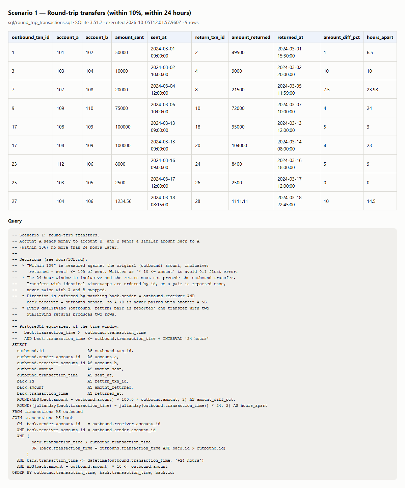
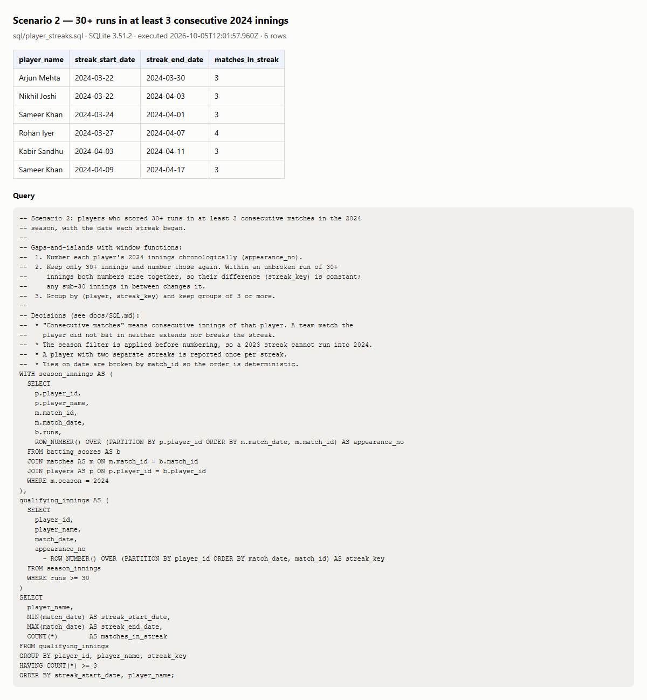

# A4 — SQL scenarios

| File                                                                    | Purpose                                                                |
| ----------------------------------------------------------------------- | ---------------------------------------------------------------------- |
| [`sql/schema.sql`](../sql/schema.sql)                                   | Table definitions                                                      |
| [`sql/seed.sql`](../sql/seed.sql)                                       | Synthetic data; every edge case is annotated with its expected outcome |
| [`sql/round_trip_transactions.sql`](../sql/round_trip_transactions.sql) | Scenario 1                                                             |
| [`sql/player_streaks.sql`](../sql/player_streaks.sql)                   | Scenario 2                                                             |

**Engine:** SQLite 3.51 through Node's built-in `node:sqlite`, so no database server or native
build step is needed. The queries use standard window functions. The comments note the
PostgreSQL equivalent of the one SQLite-specific expression (`datetime(..., '+24 hours')`).

**Run:**

- `npm run sql` prints both result sets and writes Markdown tables and PNG screenshots to
  [`reports/sql/`](../reports/sql/). The screenshots are rendered from the actual query results.
- `npm run test:sql` runs Cucumber scenarios that assert the _exact_ expected rows. Those rows
  were derived by hand from the annotated seed, not copied from query output.

## Scenario 1: round-trip transfers

Find account A sending money to B, and B sending a similar amount (within 10%) back to A within 24 hours.

**Approach:** a self-join of `transactions`, where `back` is the return leg of `outbound`.

- **Direction:** `back.sender = outbound.receiver AND back.receiver = outbound.sender`. This is
  what stops A→B being matched with another A→B.
- **Order and window:** `back` is not earlier than `outbound` and is at most 24 hours later.
  Identical timestamps are ordered by id, so a pair is reported **once**, not once in each direction.
- **Similar amount:** `|returned − sent| × 10 ≤ sent`. That's "within 10% of the amount sent",
  inclusive, written without `0.1` to avoid floating-point error.

**Decisions:**

- 10% is measured against the **sent** amount. Case 10 in the seed is 11% of the sent amount and
  9.9% of the returned one, and it is not a match. Measuring against the smaller amount or the
  mean are both defensible; this choice is stated in the query.
- Both boundaries are inclusive: exactly 10% and exactly 24 hours match.
- Every qualifying pair is reported. Case 9 (one transfer with two qualifying returns) gives two rows.

**Edge cases in the seed (expected → actual):** a clear round trip ✓; exactly 10% ✓; 10.1% ✗;
7.5% higher at 23 h 59 m ✓; exactly 24 h ✓; 24 h + 1 s ✗; same direction twice ✗; an onward
chain A→B→C ✗; multiple returns (5% ✓, 50% ✗, 4% ✓); the base-amount case ✗; a round trip
started by the other party ✓; identical timestamps, reported once ✓; amounts with paise at
9.9996% ✓; a late repeat 20 days later ✗. Result: **9 rows**, exactly the expected set.

## Scenario 2: IPL player streaks

Find players with 30+ runs in at least 3 consecutive matches in 2024, and the date each streak began.

**Approach (gaps and islands):**

1. Number each player's 2024 innings by date: `appearance_no`.
2. Keep only innings of 30 or more and number them again. Inside an unbroken streak both
   numbers rise together, so `appearance_no − ROW_NUMBER()` is constant. Any sub-30 innings
   in between changes it.
3. `GROUP BY player, streak_key HAVING COUNT(*) >= 3`. `MIN(match_date)` is the start date.

**Decisions:**

- "Consecutive matches" means **consecutive innings of that player**. A team match the player
  didn't bat in neither extends nor breaks the streak (Nikhil Joshi in the seed). If the
  requirement were consecutive _team_ matches, number the team's matches instead and treat a
  missing innings as a break.
- The season filter is applied **before** numbering. Vikram Rao's 40 and 50 at the end of 2023
  followed by 35 in 2024 is not a 2024 streak.
- A player with two separate streaks gets two rows (Sameer Khan).
- 30 counts as "30+" (Arjun Mehta's third innings is exactly 30). Dev Malhotra alternates 29
  and 30 and never qualifies.

**Data:** synthetic. The player names and scores are fictional, and franchise names are used only for flavour.
Result: **6 rows**, exactly the expected set.

